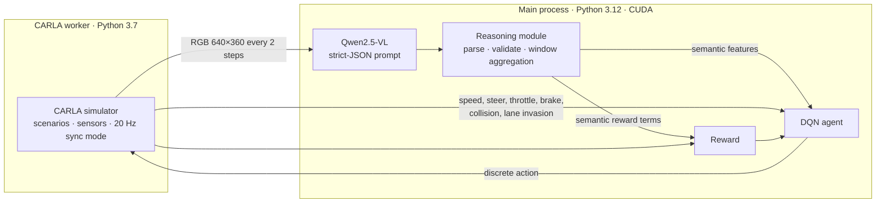

# VLM-Assisted Reinforcement Learning for Autonomous Driving in CARLA

**Can a Vision-Language Model's scene understanding make a reinforcement learning driving agent safer in edge cases?**

This project couples **Qwen2.5-VL** (semantic scene understanding from the front camera) with an **online DQN agent** (high-level driving decisions) in the **CARLA** simulator. It compares the result against an RL-only baseline with the same network, action space and evaluation scenario.


> P2M engineering project, SUP'COM (Higher School of Communications of Tunis), 2025–2026
> Tasnim Selmi · Leith Mabrouk. Supervised by Ms. Sameh Najeh

---

## Key results at a glance

Evaluation on the **combined edge-case scenario** (night, heavy rain, wet road, fog, dense traffic, pedestrians, vehicle ahead), which neither agent saw during training. 20 episodes per agent, up to 1000 steps each:

| Metric (mean per episode) | RL-only | VLM + RL |
|---|---|---|
| Collision rate ↓ | 1.00 | **0.10** |
| Lane invasions ↓ | 3.75 | **0.50** |
| Survival length (steps, max 1000) ↑ | 251.2 | **946.6** |
| Most frequent action | `turn_right` (~70%) | `brake` (~80%) |
| Typical speed | ~3–17 km/h | **< 2 km/h** ⚠️ |


**Takeaway:** VLM semantic signals drastically reduced collisions and lane invasions, **but the resulting policy is over-conservative**: the VLM-assisted agent brakes most of the time and barely moves forward. The safety gain is therefore not evidence of better driving on its own. [Analysis & limitations](#analysis--limitations) traces this behavior back to specific design choices in the code.

---

## Motivation

RL driving agents usually rely on numerical observations and hand-designed rewards. In edge cases such as poor visibility, crossing pedestrians or dense traffic, these observations miss the *semantics* of the scene: *is someone about to cross? is this lane safe?*

[VLM-RL (Huang et al., 2024)](https://arxiv.org/abs/2412.15544) uses VLMs to build semantic rewards for continuous-control driving. This project studies a different setting: **VLM outputs as structured state features and reward signals for a discrete, interpretable decision-level agent.**

---

## Method

### System architecture

CARLA's Python client requires Python 3.7, while the VLM stack needs a recent PyTorch and Transformers. The system therefore runs as **two processes**. The main process (Python 3.12) hosts the DQN and the VLM, and drives a CARLA worker (Python 3.7) through a JSON protocol over stdin/stdout.



### Agents

| | RL-only (baseline) | VLM + RL |
|---|---|---|
| Algorithm | Online DQN: experience replay, target network, ε-greedy | same |
| Actions (6) | `continue`, `slow_down`, `brake`, `turn_left`, `turn_right`, `correct_lane` | same |
| State | 6 features: speed, steering, throttle, brake, collision flag, lane-invasion flag | 11 features: the same 6 **+ 5 VLM features** (hazard level, obstacle, collision risk, lane safety, action urgency) |
| Reward | base reward | base reward **+ semantic terms** |

Each discrete action maps to a fixed `carla.VehicleControl` (for example, `brake` sets brake 0.85, and `continue` sets throttle 0.45). See [`src/rl/action_space.py`](src/rl/action_space.py).

### VLM perception module

Every 2 simulation steps, the front-camera frame is sent to Qwen2.5-VL with a prompt that requires a JSON object with exactly six keys ([`src/vlm/prompt.py`](src/vlm/prompt.py)):

```json
{
  "hazard_level": "low|medium|high",
  "obstacle_presence": "yes|no",
  "collision_risk": "yes|no",
  "lane_safety": "safe|unsafe",
  "crossing_pedestrian_presence": "yes|no",
  "action_urgency": "continue|slow|brake"
}
```

The **reasoning module** then works in three stages:
1. **Parse and normalize.** It extracts the JSON even when it is wrapped in extra text, fills missing keys, and falls back to a cautious default when parsing fails ([`src/vlm/vlm_interface.py`](src/vlm/vlm_interface.py)).
2. **Aggregate over a sliding window of 5 readings.** This reduces sensitivity to single-frame errors while the VLM runs at a lower rate than the simulator. The aggregation is deliberately conservative: it keeps the maximum hazard and the maximum urgency, reports collision risk if any reading says *yes*, and marks the lane unsafe if any reading says *unsafe* ([`src/rl/online/vlm_window.py`](src/rl/online/vlm_window.py)).
3. **Encode.** It maps the aggregated values to numerical state features ([`src/rl/state_encoder.py`](src/rl/state_encoder.py)).

### Reward design

The reward is defined in [`src/rl/reward.py`](src/rl/reward.py).

- **Base reward (both agents):**
  - +0.2 per step,
  - +1 for speeds of 10–35 km/h,
  - −1 below 3 km/h and −1.5 above 45 km/h,
  - −10 for a lane invasion,
  - −100 for a collision,
  - small penalties for steering, braking, and braking when already slow.
- **Semantic terms (VLM + RL only):**
  - +8 for braking under high hazard, and −8 for continuing under high hazard,
  - +6 for braking under collision risk,
  - +4 for slowing or braking when an obstacle is detected,
  - +3 for slowing or braking on an unsafe lane, and −5 for continuing on an unsafe lane.

### Training

One DQN per agent is trained **sequentially across four scenarios**: `rain` → `night` → `car_collision` → `pedestrian_collision`. The network and replay buffer carry over from one scenario to the next, and a checkpoint is saved every 10 episodes.

Main hyperparameters ([`src/rl/config.py`](src/rl/config.py)):
- learning rate 1e-3, γ = 0.99,
- replay buffer 10k, batch size 64,
- ε decayed from 1.0 to 0.05 over 5k steps,
- target network updated every 250 steps,
- simulation step 0.05 s.

---

## Scenarios

Custom scenarios built with the CARLA Python API ([`src/carla_scenarios/`](src/carla_scenarios/)):

| Scenario | Used for | Setup |
|---|---|---|
| `rain` | training | heavy rain, degraded road conditions |
| `night` | training | low visibility |
| `car_collision` | training | vehicle-conflict situations |
| `pedestrian_collision` | training | pedestrians crossing near the ego vehicle |
| **`combined_edge_case`** | **evaluation only** | night + heavy rain + wet road + fog + dense traffic + pedestrians + vehicle ahead |

---

## Evaluation protocol

Both agents are evaluated with the same pipeline, which logs every timestep and aggregates per episode and per agent:
- safety: collision rate, collision speed, collisions per 1000 steps, collisions per km,
- lane invasions,
- driving progress: distance travelled, average speed,
- action distribution,
- for the VLM agent, the semantic signals and VLM latency.

Metric definitions and thresholds are documented in [`docs/evaluation_metrics.md`](docs/evaluation_metrics.md).

Episode rewards are logged but **not used to compare the agents**, because the two agents are trained on different reward functions.

---

## Analysis & limitations

We report these openly because they matter more than the headline numbers.

1. **The over-conservative policy has identifiable causes.** The VLM + RL agent brakes in about 80% of steps and stays close to standstill. Four design choices push it there:
   - **Reward scale.** The semantic bonuses for braking (+6 to +8 per step) are far larger than the penalties for driving too slowly (about −1 to −2). As soon as the VLM flags a hazard, braking is the best action by a wide margin.
   - **Conservative aggregation.** A single *yes* for collision risk or a single *unsafe* lane reading in the window flags the whole window, and hazard takes the maximum over the window. Hazard flags therefore stay on most of the time.
   - **Cautious fallback.** When the VLM output cannot be parsed, or the window is still empty, the default reports medium hazard, collision risk, an obstacle and an unsafe lane.
   - **Unused pedestrian signal.** The VLM is asked about crossing pedestrians, but that field is not part of the 11-feature state.

   This is a form of **reward exploitation driven by uncalibrated perception**, not a failure of DQN itself.
2. **Safety numbers need to be read together with progress.** A near-stationary agent rarely collides. Collision results should always be read alongside distance travelled and average speed.
3. **Two changes at once.** The VLM agent differs from the baseline in both its **state** and its **reward**, so the improvement cannot be attributed to either one alone.
4. **The baseline has limited information.** The RL-only agent has no information about surrounding vehicles or pedestrians before a collision happens, which favors the VLM agent.
5. **Limited statistics.** There is one training run per agent, 20 evaluation episodes and one evaluation scenario.

### Possible next steps

- Ablation: VLM features in the state only, semantic reward only, and both combined.
- A trivial *always-brake* baseline, plus a privileged baseline that receives ground-truth distances to vehicles and pedestrians from CARLA.
- Measure VLM accuracy against CARLA ground truth, for example pedestrian-detection precision and recall.
- A progress-based reward with rebalanced semantic terms, reported as a safety–progress trade-off.
- Multiple training seeds, confidence intervals and held-out CARLA towns.

---

## Repository structure

```
src/
├── Carla_integration/   # CARLA environment wrapper and scenario loader
├── carla_scenarios/     # rain, night, car_collision, pedestrian_collision, combined_edge_case
├── vlm/                 # Qwen2.5-VL loading, prompt, inference, JSON parsing
├── reasoning/           # CARLA data loading and frame sampling (offline VLM pipeline)
└── rl/
    ├── agents/          # DQN and replay buffer
    ├── online/          # CARLA worker, remote env, training, evaluation, plotting
    ├── offline/         # early offline DQN experiments on recorded data
    ├── action_space.py  # discrete actions → CARLA vehicle controls
    ├── state_encoder.py # observation and VLM output → state vector
    └── reward.py        # base and semantic reward
scripts/
├── bdd100k/             # VLM prompt tests on real driving images (BDD100K)
└── carla/               # sampler tests
docs/
└── evaluation_metrics.md
```

The project started with an **offline phase**: recorded CARLA scenarios, frame sampling, and VLM prompt testing on both CARLA frames and real BDD100K images. It then moved to online RL so the agent could learn from the consequences of its own actions.

---

## Installation

**Requirements:**
- the CARLA simulator,
- an NVIDIA GPU with CUDA 12.1 (running CARLA and the VLM together is heavy; we used a remote GPU virtual machine).

The code uses two virtual environments, both created at the project root.

```bash
git clone https://github.com/TasnimSelmi/decision-support-autonomous-vehicles.git
cd decision-support-autonomous-vehicles

# 1) CARLA worker environment (Python 3.7)
python3.7 -m venv carla_env_37
source carla_env_37/bin/activate
pip install -r requirements.txt
# also install the CARLA Python API matching your simulator version
deactivate

# 2) Main RL + VLM environment (Python 3.12)
python3.12 -m venv rl_env_312
source rl_env_312/bin/activate
pip install -r requirements_3.txt
```

The main process launches the worker automatically with `carla_env_37/bin/python`, so the environment must keep that name and location.

The VLM checkpoint is set by `MODEL_NAME` in [`src/vlm/config.py`](src/vlm/config.py).

### Start CARLA

```bash
./CarlaUE4.sh -carla-rpc-port=2000                   # with display
./CarlaUE4.sh -RenderOffScreen -carla-rpc-port=2000  # headless

python test_carla.py                                 # check the connection
```

---

## Usage

Run all commands from the project root with `rl_env_312` activated.

### Training

```bash
python -m src.rl.online.train_online_carla_remote    # RL-only agent
python -m src.rl.online.train_vlm_rl_carla_remote    # VLM + RL agent
```

Trained weights are not included in the repository. If a run is interrupted, the `*_resume_*_remote.py` scripts restart training from a saved checkpoint.

### Evaluation on the combined edge case

```bash
python -m src.rl.online.evaluate_combined_edge_remote \
    --model <path/to/rl_only.pth> --episodes 20 --max-steps-per-episode 1000 \
    --output-prefix rl_only_combined_edge

python -m src.rl.online.evaluate_vlm_rl_combined_edge_remote \
    --episodes 20 --max-steps-per-episode 1000 \
    --output-prefix vlm_rl_combined_edge
```

To run long evaluations in the background:

```bash
mkdir -p outputs/logs
nohup python -u -m src.rl.online.evaluate_combined_edge_remote --episodes 20 \
    --output-prefix rl_only_combined_edge > outputs/logs/evaluate_rl_only.log 2>&1 &
tail -f outputs/logs/evaluate_rl_only.log
```

Results are written to `outputs/results/online_evaluation/`, split into `raw/` (per step), `episodes/`, `aggregate/` and `figures/`.

### Plots

```bash
python -m src.rl.online.plot_combined_edge_comparison
```

---

## References

1. Dosovitskiy et al., *CARLA: An Open Urban Driving Simulator*, CoRL 2017. [arXiv:1711.03938](https://arxiv.org/abs/1711.03938)
2. Mnih et al., *Playing Atari with Deep Reinforcement Learning*, 2013. [arXiv:1312.5602](https://arxiv.org/abs/1312.5602)
3. Wang et al., *Qwen2-VL: Enhancing Vision-Language Model's Perception of the World at Any Resolution*, 2024. [arXiv:2409.12191](https://arxiv.org/abs/2409.12191)
4. Huang et al., *VLM-RL: A Unified Vision Language Models and Reinforcement Learning Framework for Safe Autonomous Driving*, 2024. [arXiv:2412.15544](https://arxiv.org/abs/2412.15544)
5. Guillen-Perez, *From Imitation to Optimization: A Comparative Study of Offline Learning for Autonomous Driving*, 2025. [arXiv:2508.07029](https://arxiv.org/abs/2508.07029)
